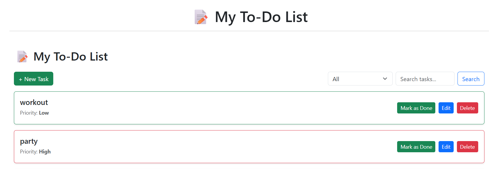

# 📝 Django To-Do List App

A simple yet robust To-Do List web application built with Django.  
Each user can sign up, log in, and manage their own personal tasks in a secure, isolated environment.

---

## 📌 Features

- 🔐 User Registration & Login
- ✅ Create, Update, and Delete Tasks
- 📋 Mark Tasks as Completed
- 📆 Task Due Date and Priority
- 👤 Per-user Task Isolation
- 📱 Responsive UI (basic styling)
- ✍️ Form validation and user feedback

---

## 🚀 Getting Started

### 🔧 Requirements

- Python 3.10+
- pip
- virtualenv (recommended)

### 📦 Installation

```bash
# Clone the repository
git clone https://github.com/your-username/django_todo_project.git
cd django_todo_project

# Create virtual environment
python -m venv venv
source venv/bin/activate  # On Windows: venv\Scripts\activate

# Install dependencies
pip install -r requirements.txt

# Apply migrations
python manage.py migrate

# Create superuser (optional)
python manage.py createsuperuser

# Run the development server
python manage.py runserver
```
## 🗂️ Project Structure

```bash
django_todo_project/
│
├── tasks/                  # Main app
│   ├── models.py           # Task model
│   ├── views.py            # Task views (CRUD)
│   ├── forms.py            # Django forms
│   ├── urls.py             # App URLs
│   └── templates/tasks/    # HTML templates
│
├── templates/registration/ # Auth templates (login, signup)
├── static/                 # Optional static files
├── db.sqlite3              # Default database
├── manage.py
└── requirements.txt

```

## 🔐 User Authentication
Uses Django's built-in authentication system

Only authenticated users can view or manage their tasks

Tasks are user-specific and cannot be accessed by others

## 📸 Screenshots


## 🧪 Future Improvements (Optional Ideas)
Add AJAX-based interactions for marking tasks as done

Add categories/tags for tasks

Add due date filtering and sorting

Add REST API (with Django REST Framework)

Add notifications or reminders

## 🧑‍💻 Author
Developed by Hesam, as a learning project to practice Django fundamentals.

Guided and documented step-by-step with Git versioning and markdown.

## 📄 License
This project is open-source and available under the MIT License.

